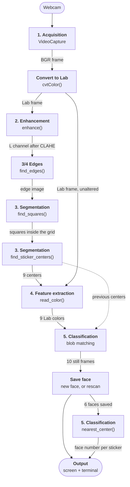

# Architecture: Rubik's cube scanner

Each box = one function in `rubiks_scanner.cpp`.
The cube is held inside the guide grid in the middle of the camera view.

```mermaid
flowchart TD
    cam(["Webcam"])

    capture["`**1. Acquisition**
VideoCapture`"]
    toLab["`**Convert to Lab**
cvtColor()`"]
    enhance["`**2. Enhancement**
enhance()`"]
    edges["`**3/4 Edges**
find_edges()`"]
    squares["`**3. Segmentation**
find_squares()`"]
    centers["`**3. Segmentation**
find_sticker_centers()`"]
    colors["`**4. Feature extraction**
read_color()`"]
    blobs["`**5. Classification**
blob matching`"]
    save["`**Save face**
new face, or rescan`"]
    classify["`**5. Classification**
nearest_center()`"]
    output(["`**Output**
screen + terminal`"])

    cam --> capture
    capture -->|BGR frame| toLab
    toLab -->|Lab frame| enhance
    enhance -->|L channel after CLAHE| edges
    edges -->|edge image| squares
    squares -->|squares inside the grid| centers
    centers -->|9 centers| colors
    toLab -->|Lab frame, unaltered| colors
    colors -->|9 Lab colors| blobs
    centers -.->|previous centers| blobs
    blobs -->|10 still frames| save
    save -->|6 faces saved| classify
    save --> output
    classify -->|face number per sticker| output
```
